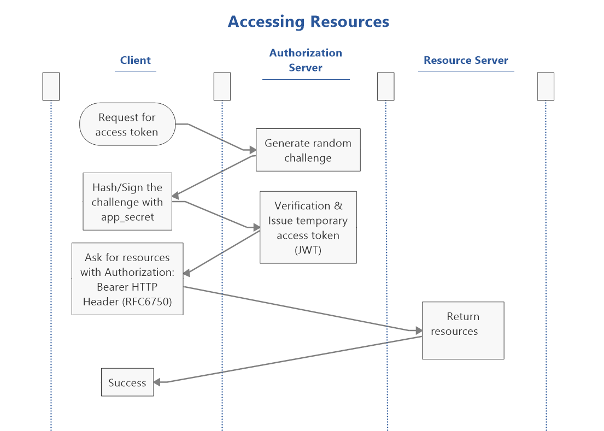

# Central Authentication Service Provider (TUSSO)

The centralized authentication system for Triamudom personnel, based on Laravel 5.2.

**This version of TUSSO utilizes existing directory server** ("TUSSO as Extension")

Please read the [contribution guide](./CONTRIBUTING.md) before contributing any changes.

## Features
- Integrated with directory server using LDAP
- Implemented OpenID Connect implicit, authorization code, and hybrid flow as provider (OP)
- Issues resource access tokens (as JWT, signed using RSA)
- Works during directory server connection failure, using local database
- Implemented single sign-out. (not comply with OpenID Connect Session Management)
- Utilize Credential Management API, making sign-in easier for Chrome 51+ users.
- WIP: Used as Captive Portal Auth for Unifi AP
- WIP: Works with Nginx auth_module
- Allow new student to register for temporary account by working with registration dept. student database (Disabled)

### Specification/Standard Compliance
- OpenID Connect Core 1.0
- The OAuth 2.0 Authorization Framework: Bearer Token Usage
- OAuth 2.0 Threat Model and Security Considerations (RFC6819)
- JSON Web Token (JWT) (draft)
- Credential Management Level 1 (W3C Working Draft, 25 April 2016)

### Using with resource server

## Developers

Siwat Techavoranant (keen at keendev.net)

## License

TUSSO is open-sourced software licensed under the [GNU General Public License v3.0](./LICENSE.txt)

    Copyright (C) 2017 Siwat Techavoranant

    This program is free software: you can redistribute it and/or modify
    it under the terms of the GNU General Public License as published by
    the Free Software Foundation, either version 3 of the License, or
    any later version.

    This program is distributed in the hope that it will be useful,
    but WITHOUT ANY WARRANTY; without even the implied warranty of
    MERCHANTABILITY or FITNESS FOR A PARTICULAR PURPOSE.  See the
    GNU General Public License for more details.